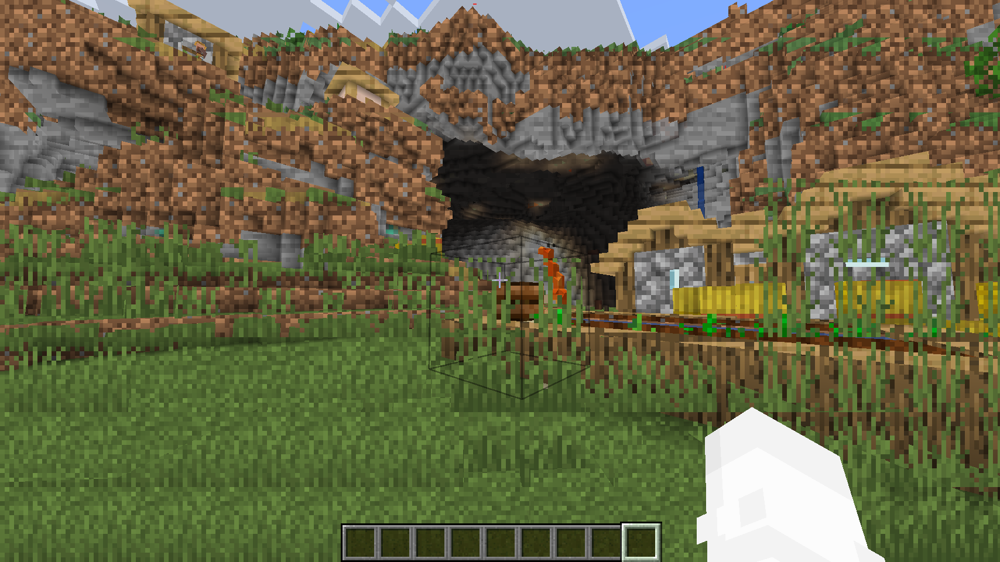
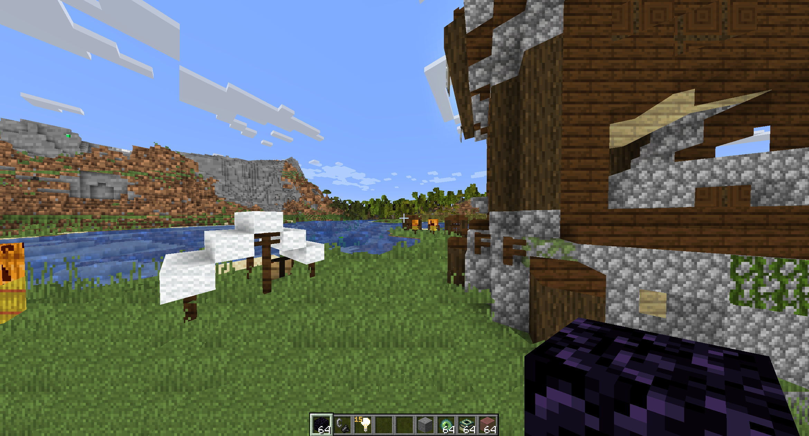

# Projected Textures

A Minecraft Java Edition shaderpack for Iris (maybe works on optifine) that uses screen UVs for block textures

Original code by [Acientkingg](https://github.com/Ancientkingg) on GitHub [here](https://github.com/Ancientkingg/shader-shenanigans/tree/master/projected_blocks)
This was translated from Minecraft core shaders into Iris, as the resource packs no longer function in the latest versions of Minecraft.

Screenshots

